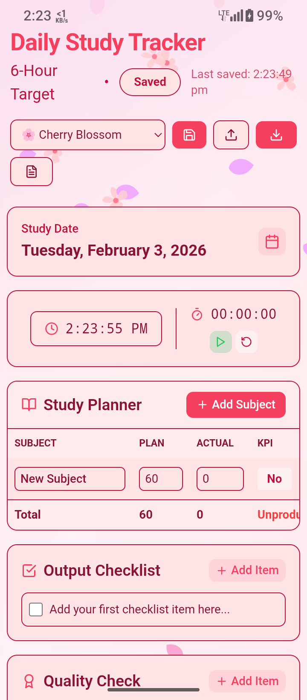
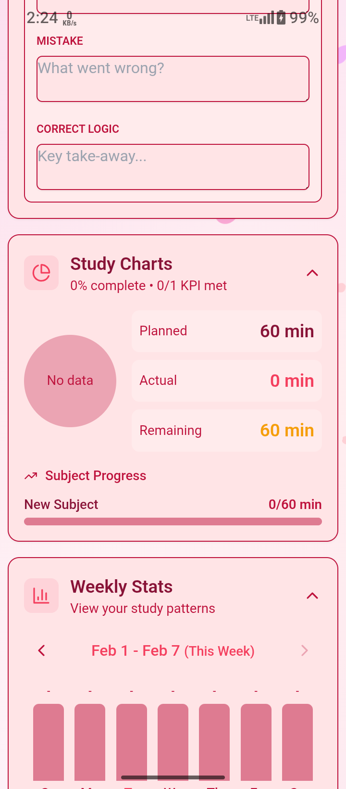
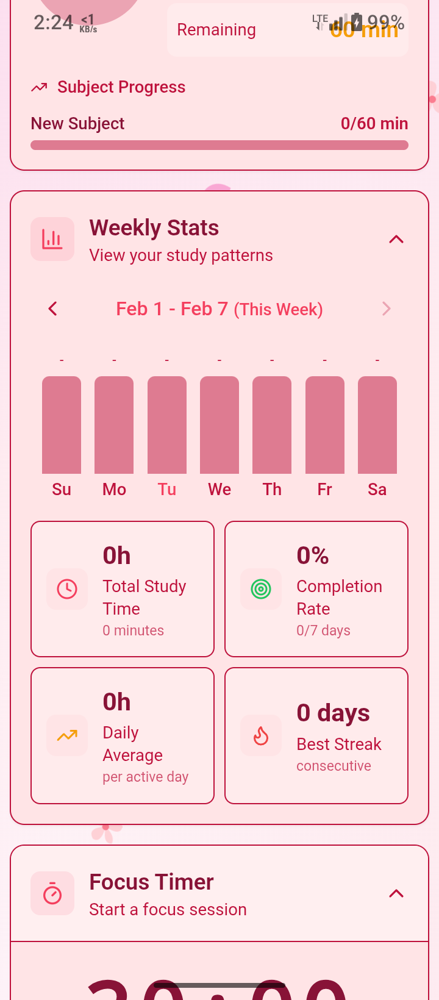
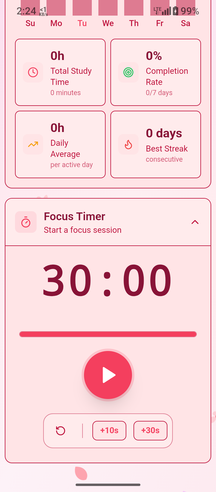
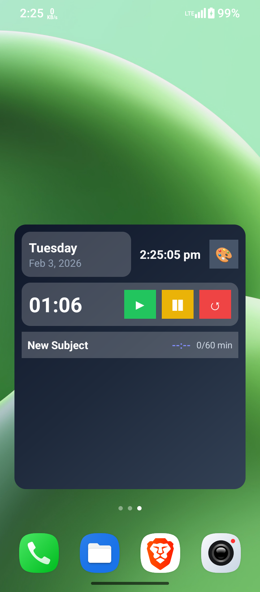
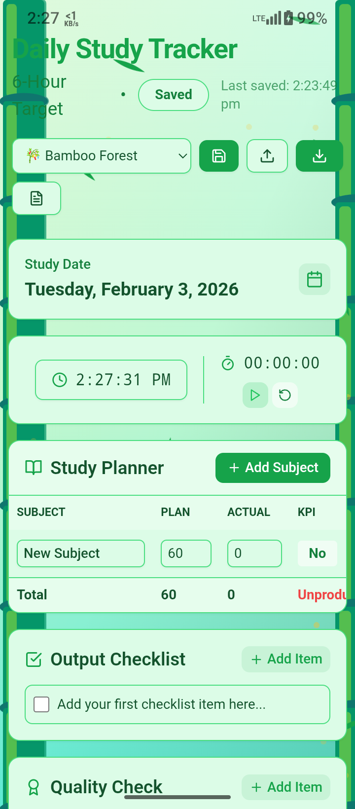
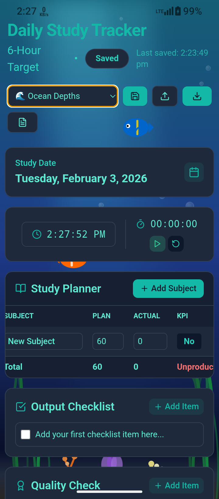
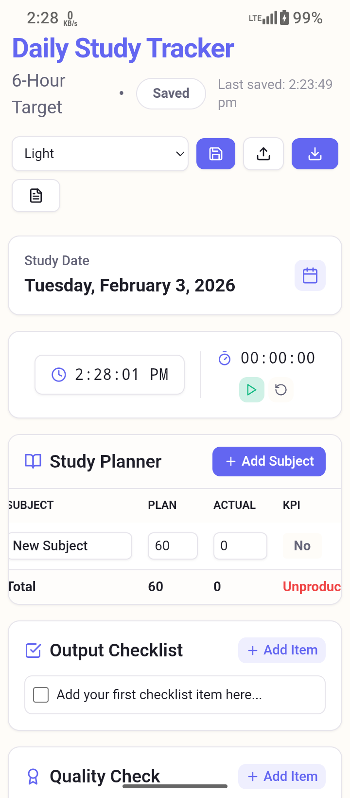
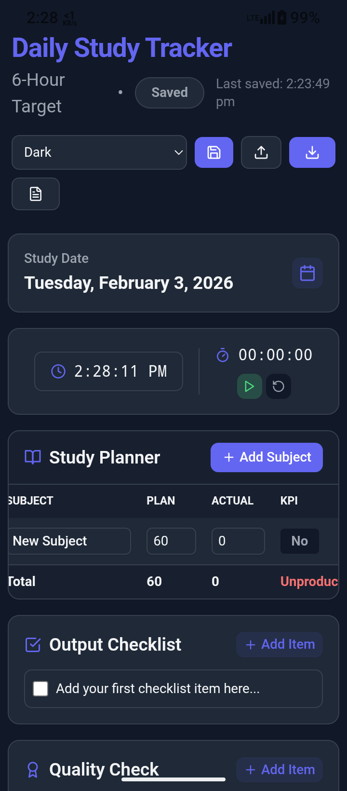

# 📚 Daily Study Tracker

A beautiful, feature-rich study tracking application built with React. Track your daily study progress, set goals, and stay motivated with stunning animated themes.

  

### 🌐 Live Demo
The app is fully functional and live on the web at: **[dailystudytracker.onrender.com](https://dailystudytracker.onrender.com)**

## ✨ Features

### 📊 Study Tracking
- **6-Hour Daily Target** - Track study time across multiple subjects
- **Subject Management** - Add or remove subjects dynamically
- **KPI Tracking** - Mark subjects as completed (Y/N)
- **Smart Day Rating** - Automatic rating based on your progress
- **Study Charts** - Visual pie charts and progress bars for time distribution

### 📈 Stats & Analysis
- **Weekly Stats** - View study patterns with bar charts
- **Study Streak** - Track consecutive days studied
- **Completion Rate** - See daily and weekly goal completion %

### ✅ Productivity Tools
- **Daily Checklist** - Track specific study tasks
- **Quality Check** - Self-assessment questions
- **Error Log** - Document mistakes and learnings
- **Real-time Clock** - Stay aware of time
- **Stopwatch** - Built-in timer for study sessions
- **Focus Timer** - Adjustable countdown timer with hours/minutes/seconds

### 🔔 Smart Notifications
- **Study Reminders** - Set specific times for each subject
- **Continuous Alarm** - High-priority alarm that rings for 30s+ to wake you up
- **Reliable Alerts** - Works even when app is closed or in background
- **One-Time Schedule** - Alarms ring only for the set day (no unwanted repeats)

### 📲 Home Screen Widget
- **Mini-App Widget** - View your schedule without opening the app
- **Widget Actions** - Play/Pause timer directly from home screen
- **Theme Toggle** - Switch between Dark and Light modes
- **Real-time Sync** - Updates instantly when app data changes
> **Note:** The persistent stopwatch notification is exclusively for the Widget timer.

### 🎨 Beautiful Themes (In-App)
| Theme | Description |
|-------|-------------|
| ☀️ Light | Warm cream tones with indigo accents |
| 🌙 Dark | Classic dark mode with indigo highlights |
| 🌿 Material Day | Fresh teal/mint aesthetic |
| 💜 Material Night | Modern purple/violet design |
| 🌸 Cherry Blossom | Animated falling petals (Default) |
| 🎋 Bamboo Forest | Peaceful green with floating leaves |
| 🌊 Ocean Depths | Underwater world with fish & bubbles |

### 📱 Cross-Platform
- **Web Browser** - Works on any modern browser
- **Android App** - Native APK with Capacitor
- **Persistent Storage** - Data saved locally on device
- **Auto-Save** - Automatically saves progress every 10 seconds

### 📤 Export & Backup
- **PDF Export** - Professional formatted report
- **Markdown Export** - Plain text for notes apps
- **Backup & Restore** - Export all data to JSON and restore on any device

## 🚀 Getting Started

### Prerequisites
- Node.js 18+
- npm or yarn

### Installation

```bash
# Clone the repository
git clone https://github.com/sumon317/DailyStudyTracker.git
cd DailyStudyTracker

# Install dependencies
npm install

# Start development server
npm run dev
```

### Build for Production

```bash
npm run build
```

### Build Android APK

```bash
# Sync web assets to Android
npx cap sync android

# Open in Android Studio
npx cap open android

# Build APK: Build → Build Bundle(s) / APK(s) → Build APK(s)
```

## 🛠️ Tech Stack

- **Frontend**: React 18, Tailwind CSS
- **Animations**: Framer Motion, CSS Animations
- **Storage**: Dexie.js (IndexedDB), Capacitor Filesystem
- **Mobile**: Capacitor (Android)
- **Build**: Vite
- **Icons**: Lucide React

## 📁 Project Structure

```
DailyStudyTracker/
├── src/
│   ├── components/     # React components (Charts, Stats, Tracker, etc.)
│   ├── utils/          # PDF & Markdown generators
│   ├── db.js           # Database & storage logic
│   ├── App.jsx         # Main application
│   └── index.css       # Theme styles
├── android/            # Capacitor Android project
├── public/             # Static assets
└── dist/               # Production build
```

## 📸 Screenshots

<p float="left">
  
  
  
   
  
  
  
  
  
  
</p>

## 🤝 Contributing

Contributions are welcome! Feel free to open issues or submit pull requests.

## 📄 License

This project is licensed under the MIT License.

## 👨‍💻 Author

**Sumon317** - [GitHub](https://github.com/sumon317)

---

Made with ❤️ for productive studying
